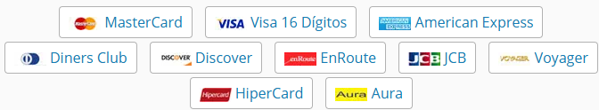

# Módulo 3 - Criando um Validador de Bandeiras de Cartão de Crédito com o GitHub Copilot - Concluído em 10/01/2025

## **Texto do Desafio:**

Criar uma ferramenta que seja capaz de validar cartões de crédito do site 4devs, com a ajuda de uma I.A, a linguagem de programação pode ser da escolha do desafiado.

Estes são os cartões disponíveis do dia 10/01/2025



    Nota do site 4devs

    IMPORTANTE: Nosso gerador online de Cartão de Crédito tem como intenção ajudar estudantes, programadores, analistas e testadores a gerar Cartões válidos. Normalmente necessários para testar seus softwares em desenvolvimento.
    Esses dados não servem para fazer compras na internet.
    A má utilização dos dados aqui gerados é de total responsabilidade do usuário.
    Os números são gerados de forma aleatória, respeitando as regras de criação de cada documento.

## **Resolução do Desafio (explicações e prints):**

Parte da própia explicações está no arquio "Validador de Cartão (Python)", vamos testar os seguintes códigos


Códigos já prontos para copiar

```2014 6593273 6814```

```6062 8289 8086 2672```

```3573 4061 9530 1510```

```4716 3852 6361 2394```

**Prints do código rodando no google colabs**


Teste de um código inválido


## **Ferramentas Usadas:**

[Chat GPT 4o mini](https://chatgpt.com/)

[Visual Studio Code](https://code.visualstudio.com/)

[Google Docs](https://docs.google.com/)

[Google Colab](https://colab.research.google.com/)